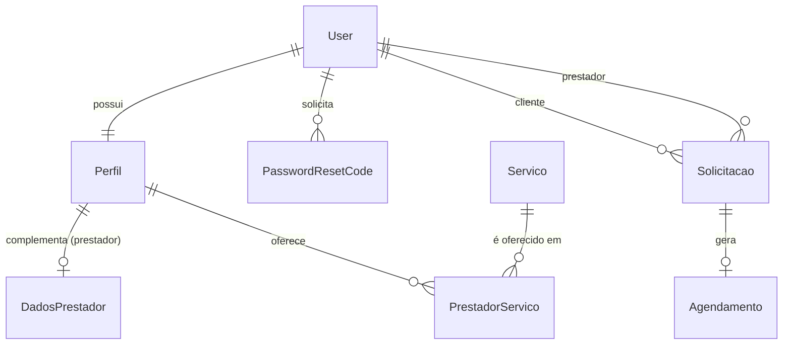

# API FazUno — V1

API REST do FazUno (intermediação entre clientes e prestadores de serviço), consumida pelo aplicativo mobile.

## Visão geral

| | |
|---|---|
| Stack | Python, Django, Django REST Framework |
| Banco | SQLite (desenvolvimento) |
| URL base | `http://127.0.0.1:8000` |
| Formato | JSON (`Content-Type: application/json`) |
| Autenticação | Não exigida na V1 |

Convenções:

- Toda rota termina com `/`.
- Datas em `AAAA-MM-DD`; horários em `HH:MM`.
- `user`, `cliente_id` e `prestador_id` recebem id de **usuário**; `prestador` (em serviços) recebe id de **perfil**.

## Execução

```bash
python -m venv venv
venv\Scripts\activate          # Linux/macOS: source venv/bin/activate
pip install django djangorestframework django-cors-headers
python manage.py migrate
python manage.py createsuperuser   # opcional: acesso ao /admin/
python manage.py runserver
```

Em desenvolvimento, e-mails (inclusive o código de recuperação de senha) são impressos no console do `runserver`.

## Estrutura

| Arquivo | Responsabilidade |
|---|---|
| `FazUno/urls.py` | Roteamento |
| `FazUno/views.py` | Regras de negócio e respostas HTTP |
| `FazUno/serializers.py` | Validação e serialização |
| `FazUno/models.py` | Entidades |
| `FazUno/admin.py` | Painel administrativo |
| `FazUno/settings.py` | Configuração (apps, banco, e-mail, CORS, DRF) |

## Modelo de dados



| Entidade | Campos principais |
|---|---|
| `Perfil` | `user` (1:1), `tipo` (`cliente` \| `prestador`), `telefone` |
| `DadosPrestador` | `perfil` (1:1), `area_atuacao`, `descricao` — existe apenas para perfis `prestador` |
| `Servico` | `nome`, `descricao` — item do catálogo |
| `PrestadorServico` | `prestador` (Perfil), `servico`, `valor` — vínculo N:N com o preço de cada prestador; par único |
| `Solicitacao` | `cliente`, `prestador`, `servico` (texto), `descricao`, `data_servico`, `horario`, `valor`, `endereco`, `status` |
| `Agendamento` | `solicitacao` (1:1), `data`, `horario`, `local`, `status` |
| `PasswordResetCode` | `user`, `code` (6 dígitos), `is_used`; validade de 15 min |

## Regras de status

**Solicitação** — transições permitidas; demais retornam `400`:

| De | Para |
|---|---|
| `pendente` | `aceita`, `recusada`, `cancelada` |
| `aceita` | `concluida`, `cancelada` |
| `recusada`, `cancelada`, `concluida` | — (finais) |

**Agendamento** — status `agendado`, `em_andamento`, `concluido`, `cancelado`. Agendamentos `concluido` ou `cancelado` não podem ser alterados. O cancelamento propaga `cancelada` para a solicitação.

## Erros

| Código | Uso |
|---|---|
| `200` / `201` | Sucesso / criação |
| `400` | Dados inválidos ou regra de negócio violada |
| `401` | Credenciais inválidas |
| `404` | Recurso inexistente |
| `405` | Método não suportado |

Formato padrão: `{"erro": "mensagem"}`. Endpoints baseados em serializers do DRF (serviços e agendamentos) retornam erros por campo: `{"campo": ["mensagem"]}`.

## Endpoints

| Método | Rota | Descrição |
|---|---|---|
| POST | `/api/register/` | Cadastrar usuário |
| POST | `/api/login/` | Autenticar |
| POST | `/api/password-reset/request/` | Solicitar código de recuperação |
| POST | `/api/password-reset/verify/` | Validar código |
| POST | `/api/password-reset/confirm/` | Redefinir senha |
| POST | `/api/perfil/` | Criar perfil |
| GET | `/api/prestadores/` | Listar prestadores e seus serviços |
| PUT | `/api/prestadores/<user_id>/` | Atualizar prestador |
| GET | `/api/servicos/` | Listar serviços |
| POST | `/api/servicos/` | Cadastrar serviço |
| PUT | `/api/servicos/<id>/` | Atualizar serviço |
| GET | `/api/solicitacoes/` | Listar solicitações |
| POST | `/api/solicitacoes/` | Criar solicitação |
| PATCH | `/api/solicitacoes/<id>/status/` | Alterar status |
| GET | `/api/agendamentos/` | Listar agendamentos |
| POST | `/api/agendamentos/` | Criar agendamento |
| GET | `/api/agendamentos/<id>/` | Detalhar agendamento |
| PUT | `/api/agendamentos/<id>/atualizar/` | Atualizar agendamento |
| PUT | `/api/agendamentos/<id>/cancelar/` | Cancelar agendamento |

Campos marcados com `*` são obrigatórios.

¹ Política de senha: mínimo de 8 caracteres, com maiúscula, minúscula, número e caractere especial.

### Autenticação

#### `POST /api/register/`
Cria um usuário.

- **Corpo:** `username`* (único), `email`, `password`* (política de senha¹)
- **Retorno:** `201` com `id`, `username`, `email`
- **Erros:** `400` campo ausente, username em uso, senha fora da política

#### `POST /api/login/`
Autentica e inicia a sessão.

- **Corpo:** `username`* (username ou e-mail), `password`*
- **Retorno:** `200` com os dados do usuário
- **Erros:** `401` credenciais inválidas

#### `POST /api/password-reset/request/`
Gera código de 6 dígitos (15 min) e envia por e-mail. Resposta idêntica para e-mail existente ou não.

- **Corpo:** `email`*
- **Retorno:** `200`

#### `POST /api/password-reset/verify/`
Valida o código sem consumi-lo.

- **Corpo:** `email`*, `code`*
- **Retorno:** `200`
- **Erros:** `400` código inválido, utilizado ou expirado

#### `POST /api/password-reset/confirm/`
Redefine a senha e invalida o código.

- **Corpo:** `email`*, `code`*, `new_password`* (política de senha¹), `confirm_password`*
- **Retorno:** `200`
- **Erros:** `400` senhas divergentes, senha fora da política, código inválido

### Perfil e prestadores

#### `POST /api/perfil/`
Cria o perfil do usuário. Para `prestador`, cria também o registro de `DadosPrestador`.

- **Corpo:** `user`* (id do usuário), `tipo`* (`cliente` \| `prestador`), `telefone`, `area_atuacao` e `descricao` (somente prestador)
- **Retorno:** `201` (exemplo abaixo); `dados_prestador` só é retornado para prestador
- **Erros:** `400` campo obrigatório ausente, `area_atuacao`/`descricao` em perfil cliente

```json
{
  "id": 2,
  "user": 2,
  "tipo": "prestador",
  "telefone": "89999990000",
  "dados_prestador": {
    "area_atuacao": "Elétrica residencial",
    "descricao": "Eletricista com 10 anos de experiência"
  }
}
```

#### `GET /api/prestadores/`
Lista perfis `prestador` com os serviços oferecidos e o valor de cada um.

- **Retorno:** `200` (exemplo abaixo)

```json
[
  {
    "id": 2,
    "user": 2,
    "username": "joao",
    "email": "joao@email.com",
    "tipo": "prestador",
    "telefone": "89999990000",
    "area_atuacao": "Elétrica residencial",
    "descricao": "Eletricista com 10 anos de experiência",
    "servicos": [
      {
        "id": 1,
        "nome": "Instalação elétrica",
        "descricao": "Troca de tomadas e disjuntores",
        "valor": "150.00"
      },
      {
        "id": 2,
        "nome": "Higienização de estofados",
        "descricao": "x",
        "valor": null
      }
    ]
  }
]
```

#### `PUT /api/prestadores/<user_id>/`
Atualização parcial dos dados de acesso, do telefone e dos dados do prestador.

- **Corpo:** `username`, `email`, `password`, `telefone`, `area_atuacao`, `descricao`
- **Retorno:** `200`
- **Erros:** `404` usuário inexistente

### Serviços

#### `GET /api/servicos/`
Lista o catálogo com os prestadores vinculados.

- **Retorno:** `200` — `id`, `nome`, `descricao`, `prestadores` (`prestador`, `username`, `valor`)

#### `POST /api/servicos/`
Cadastra um serviço e seus vínculos com prestadores.

- **Corpo:** `nome`*, `descricao`*, `prestadores`* — lista de `{"prestador": <id do perfil>, "valor": <decimal ≥ 0, opcional>}`. Também aceita lista de ids (`[2, 3]`), sem valor.
- **Retorno:** `201` (exemplo abaixo)
- **Erros:** `400` por campo: perfil inexistente ou não prestador, prestador repetido, valor negativo

```json
{
  "id": 1,
  "nome": "Instalação elétrica",
  "descricao": "Troca de tomadas e disjuntores",
  "prestadores": [
    {
      "prestador": 2,
      "username": "joao",
      "valor": "150.00"
    }
  ]
}
```

#### `PUT /api/servicos/<id>/`
Substitui o serviço e seus vínculos (corpo completo).

- **Corpo:** igual ao `POST`
- **Retorno:** `200`
- **Erros:** `400` por campo · `404` serviço inexistente

### Solicitações

#### `GET /api/solicitacoes/`
Lista solicitações.

- **Retorno:** `200`

#### `POST /api/solicitacoes/`
Cria solicitação com status `pendente`.

- **Corpo:** `cliente_id`*, `prestador_id`*, `servico`* (nome do serviço), `descricao`, `data_servico`, `horario`, `valor`, `endereco`
- **Retorno:** `201`
- **Erros:** `400` cliente, prestador ou serviço ausente

#### `PATCH /api/solicitacoes/<id>/status/`
Altera o status conforme as [regras de transição](#regras-de-status).

- **Corpo:** `status`*
- **Retorno:** `200`
- **Erros:** `400` status inexistente ou transição não permitida · `404` solicitação inexistente

### Agendamentos

#### `GET /api/agendamentos/`
Lista agendamentos.

- **Retorno:** `200`

#### `POST /api/agendamentos/`
Agenda uma solicitação `aceita` (um agendamento por solicitação). Status inicial `agendado`.

- **Corpo:** `solicitacao`*, `data`* (≥ hoje), `horario`*, `local`*
- **Retorno:** `201`
- **Erros:** `400` solicitação não aceita ou já agendada, data passada

#### `GET /api/agendamentos/<id>/`
Retorna um agendamento.

- **Retorno:** `200`
- **Erros:** `404`

#### `PUT /api/agendamentos/<id>/atualizar/`
Substitui o agendamento (corpo completo; `status` opcional).

- **Corpo:** igual ao `POST`
- **Retorno:** `200`
- **Erros:** `400` agendamento concluído ou cancelado · `404`

#### `PUT /api/agendamentos/<id>/cancelar/`
Cancela o agendamento e a solicitação de origem.

- **Corpo:** —
- **Retorno:** `200`
- **Erros:** `400` agendamento concluído ou cancelado · `404`

## Painel administrativo

`/admin/` (requer superusuário). Perfis exibem inline os dados do prestador e os vínculos com serviços; serviços exibem prestadores e valores vinculados. Solicitações e agendamentos também estão registrados.

## Testes

Coleção Postman: [`docs/FazUno_API.postman_collection.json`](FazUno_API.postman_collection.json).

1. Importe a coleção e inicie o servidor.
2. Execute a coleção pelo **Collection Runner**, excluindo a pasta `7. Recuperação de senha`.

As pastas 1–5 cobrem o fluxo principal; os ids gerados são propagados por variáveis de coleção e os usuários recebem sufixo único a cada execução. A pasta 6 cobre cenários de erro. A pasta 7 é manual: o código impresso no console deve ser informado na variável `codigo`.

## Limitações da V1

| Limitação | Tratamento previsto |
|---|---|
| Ausência de autenticação e autorização nos endpoints | Permissões por tipo de usuário |
| `Solicitacao.servico` armazena o nome do serviço, sem vínculo com `Servico` ou `PrestadorServico` | Revisão do modelo de solicitação |
| Prestador referenciado por `Perfil` em serviços e por `User` em solicitações | Revisão do modelo de solicitação |
| `tipo` do perfil aceita qualquer texto; perfil duplicado ou usuário inexistente geram erro 500 | Validações de perfil |
| Solicitação sem validação de existência de cliente/prestador, data ou valor (entradas inválidas geram erro 500) | Validações de solicitação |
| E-mail não é único no cadastro | Validações de cadastro |
| Ordem dos status do agendamento não validada | Máquina de estados para agendamento |
| Listagens sem paginação | Paginação |

## Histórico

| Data | Alteração |
|---|---|
| 29/09/2026 | Integração dos módulos na branch `integracao`; restauração do módulo de solicitações; unificação de prestadores e serviços com `PrestadorServico` (valor por prestador) e dados do prestador (`DadosPrestador`) vindos de `minha-api-prestadores`; migrations unificadas; `SessionAuthentication` desativada no DRF |
